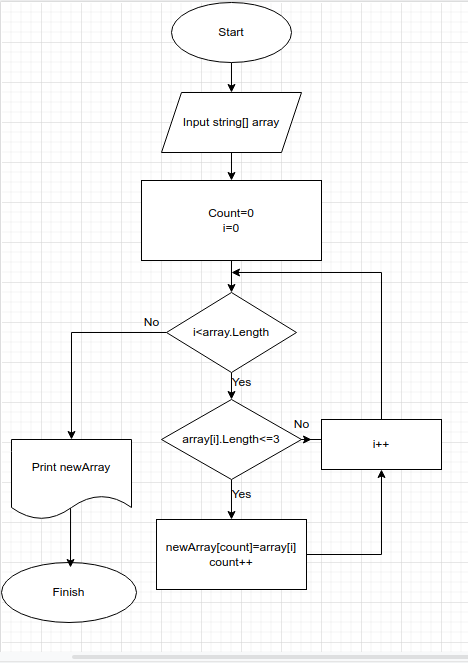

**Контрольная работа**
1. Составляем блок схему:

2. Вводим массив строк и считаем количество строк длиной не более 3-х элементов (строки 1-25);
3. Переносим строки длиной не более 3-х элементов в новый массив (строки 27-40);
4. Печатаем исходный и итоговый массивы (строки 42-63).